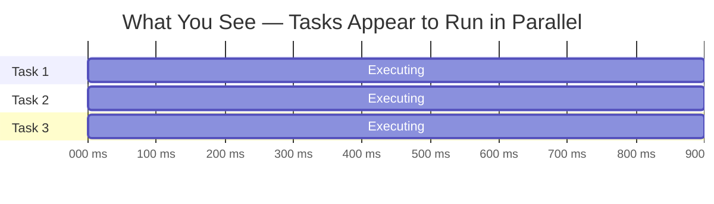
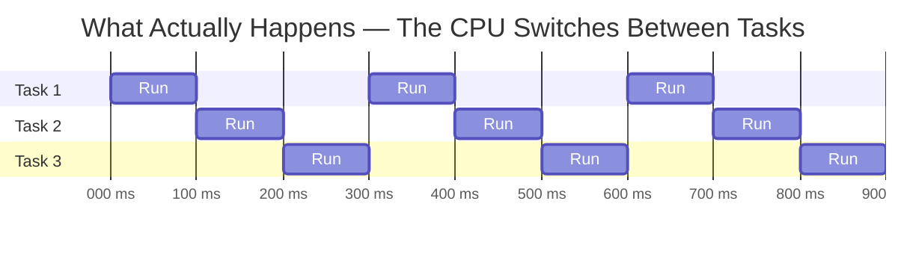
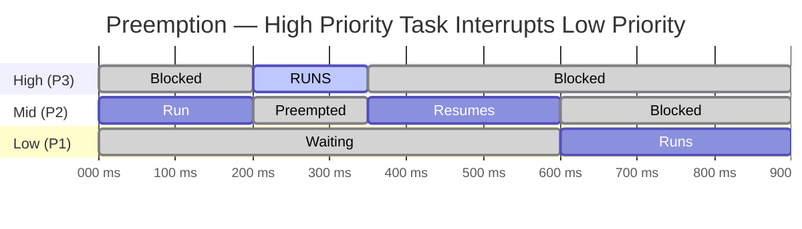
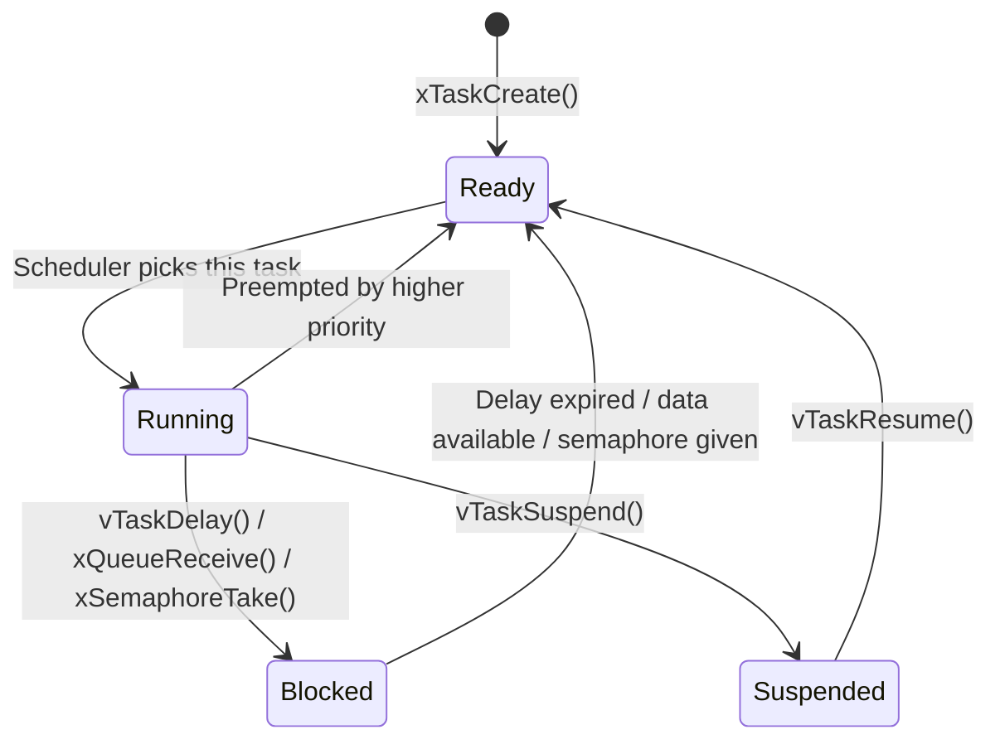

import { Aside } from '@astrojs/starlight/components';
import { Steps } from '@astrojs/starlight/components';
import { Icon } from '@astrojs/starlight/components';
import { Card, CardGrid, LinkCard } from '@astrojs/starlight/components';

## 1. The Problem: Why Your `while(1)` Loop Will Break

You already wrote a bare-metal stopwatch in Lab 0. It probably looked something like this:

```c
while (1) {
    if (buttonTick >= 20)  { scanButtons();    buttonTick = 0;  }
    if (displayTick >= 50) { updateDisplay();  displayTick = 0; }
    if (stopwatchTick >= 10){ updateTime();    stopwatchTick = 0;}
}
```

This works. Until it doesn't.

<Aside type="tip" title="Think About This">
What happens if `updateDisplay()` takes 40 ms to execute? Your buttons won't be scanned during that time. Your timekeeping drifts. And there is **nothing you can do about it** — every function shares the same loop.
</Aside>

Now imagine adding a buzzer, a sensor, and a UART logger. Each new feature makes the loop longer, the timing worse, and the bugs harder to find. You have no way to say "this function is more important than that one" — they all take turns in the same sequence.

A **Real-Time Operating System (RTOS)** solves this by letting you split your program into independent **tasks**, each with its own priority and timing. The RTOS **scheduler** decides what runs and when — not your loop structure.

---

## 2. What Is FreeRTOS?

FreeRTOS is a small, open-source RTOS designed for microcontrollers. It gives you:

| Feature | What it does | Why you care |
|:--------|:-------------|:-------------|
| **Tasks** | Independent functions that run concurrently | Each "job" lives in its own loop |
| **Scheduler** | Picks the highest-priority ready task to run | Critical work runs first, always |
| **Timing** | Precise delays and periodic execution | "Run every 10 ms" actually means 10 ms |
| **Communication** | Queues, semaphores, mutexes | Tasks share data without corruption |
| **Idle handling** | Runs a low-priority task when nothing else needs the CPU | Foundation for power management |

FreeRTOS runs on your TM4C1294XL with minimal overhead — it uses a few KB of RAM and a single hardware timer (SysTick) for its scheduler.

---

## 3. Concurrency on a Single Core

Your microcontroller has **one CPU core**. It can only execute one instruction at a time. So how do multiple tasks "run at once"?

They don't — the scheduler **switches between them so fast** that they _appear_ to run simultaneously. This is called **context switching**: saving one task's state (registers, stack pointer) and restoring another's.





The second diagram shows the reality: each task gets a small slice of time, and the scheduler rotates between them.

---

## 4. Preemption — The Key Concept

FreeRTOS uses **preemptive scheduling**. This means: if a higher-priority task becomes ready, the scheduler **immediately stops** the currently running task and switches to the higher one.



At time 200 ms, the high-priority task wakes up (maybe a timer expired or data arrived in a queue). The scheduler **preempts** the mid-priority task immediately — no waiting for it to finish. When the high-priority task blocks again (at 350 ms), the mid-priority task resumes exactly where it left off.

<Aside type="tip" title="Think About This">
In your bare-metal loop, if `updateDisplay()` is running, nothing can interrupt it — not even a time-critical sensor read. With preemption, a high-priority sensor task would instantly take over. **That is the fundamental difference.**
</Aside>

### Same Priority = Round Robin

When two or more tasks share the same priority, FreeRTOS uses **time slicing** (round robin): each gets a fixed number of ticks before the scheduler gives the next one a turn. The slice length is one tick by default.

---

## 5. Tasks

A task is a C function that **never returns**. It runs in an infinite loop, doing its job and then sleeping until it's time to work again.

```c
void MyTask(void *pvParameters) {
    // one-time setup here

    for (;;) {
        // do work
        vTaskDelay(pdMS_TO_TICKS(50));  // sleep 50 ms
    }
    // never reaches here
}
```

Each task has:
- **Its own stack** — local variables, function call frames, saved registers
- **A priority** — higher number = more important = runs first
- **A state** — one of four possibilities (see below)

You create a task with `xTaskCreate()`:

```c
BaseType_t xTaskCreate(
    TaskFunction_t pvTaskCode,       // Task entry: void (*)(void *)
    const char * const pcName,       // Debug/trace-friendly name
    configSTACK_DEPTH_TYPE usStackDepth, // Stack size (in words, NOT bytes)
    void * const pvParameters,       // Argument passed to the task
    UBaseType_t uxPriority,          // Priority (higher number = more important)
    TaskHandle_t * const pxCreatedTask // Optional handle (NULL if you don't need it)
);
```

Example:

```c
xTaskCreate(TimeTask, "Time", 512, NULL, tskIDLE_PRIORITY + 3, NULL);
```

<Aside type="caution" title="Stack units — words, not bytes">
On ARM Cortex-M ports, `usStackDepth` is in **words** (4 bytes each), not bytes. So `512` means 2048 bytes of stack. This catches everyone at least once.
</Aside>

### Choosing a Stack Size

The stack holds local variables, function call frames, and saved registers during context switches. Pick the wrong size and you get either a hard crash (too small) or wasted RAM (too large).

| Task type | Starting size | Example |
|:----------|:-------------|:--------|
| Lightweight (button scan, LED toggle) | 256 words (1 KB) | `xTaskCreate(ButtonTask, "Btn", 256, ...)` |
| Medium (timekeeping, display update) | 512 words (2 KB) | `xTaskCreate(DisplayTask, "Disp", 512, ...)` |
| Heavy (string formatting, `sprintf`, large buffers) | 1024+ words (4+ KB) | `xTaskCreate(LogTask, "Log", 1024, ...)` |

**Rules of thumb:**
1. **Start generous, then measure.** Begin with 512 words. Once your task is working, call `uxTaskGetStackHighWaterMark(NULL)` inside the task to see how many words were *never used*. Trim down, keeping a ~25% safety margin.
2. **Avoid large local arrays.** A `char buf[256]` inside a task eats 64 words of stack every time the function runs. Move large buffers to `static` storage if they don't need to be reentrant.
3. **Avoid recursion.** Each recursive call adds a full frame to the stack. On a microcontroller, this gets dangerous fast.
4. **Never go below `configMINIMAL_STACK_SIZE`.** This is the absolute minimum for the idle task — your tasks should always use at least this much.
### Task States

A task is always in exactly one of these states:



| State | Meaning | CPU usage |
|:------|:--------|:----------|
| **Running** | Currently executing on the CPU | 100% of core |
| **Ready** | Could run, but a higher-priority task is running | 0% — just waiting in line |
| **Blocked** | Waiting for time, data, or a signal | 0% — not scheduled |
| **Suspended** | Manually paused | 0% — ignored by scheduler |

**The key insight:** a Blocked task uses **zero CPU**. This is why `vTaskDelay()` is fundamentally different from a busy-wait loop — it frees the processor for other tasks.

<Aside type="tip" title="Think About This">
If all your tasks are Blocked, what runs? The **idle task** — a task that FreeRTOS creates automatically at the lowest possible priority. It runs whenever no application task needs the CPU. In later labs, you'll measure how much time the idle task gets as a way to gauge system load.
</Aside>

---

## 6. The System Tick

FreeRTOS keeps time using a periodic interrupt called the **tick**. On your system:

- `configTICK_RATE_HZ = 1000` → 1 tick = 1 ms
- The tick interrupt fires every 1 ms and lets the scheduler check if any task should wake up

All RTOS timing is in ticks. Use `pdMS_TO_TICKS(ms)` to convert:

```c
vTaskDelay(pdMS_TO_TICKS(100));  // sleep for 100 ticks = 100 ms at 1 kHz
```

<Aside type="caution" title="Resolution Limit">
You cannot schedule anything finer than one tick. At 1000 Hz, the minimum meaningful delay is 1 ms. If you need microsecond precision, you need hardware timers — not RTOS delays.
</Aside>

---

## 7. Delays: `vTaskDelay` vs `vTaskDelayUntil`

These two functions look similar but behave very differently.

### `vTaskDelay(ticks)`
Sleeps for a **relative** duration from _now_:

```c
for (;;) {
    doWork();                        // takes some time
    vTaskDelay(pdMS_TO_TICKS(50));   // then sleep 50 ms from NOW
}
```

**Actual period = work_time + 50 ms.** If `doWork()` takes 12 ms, the task repeats every 62 ms — not 50 ms. Over time, this accumulates as **drift**.

### `vTaskDelayUntil(&lastWake, ticks)`
Sleeps until an **absolute** point in time:

```c
TickType_t lastWake = xTaskGetTickCount();
for (;;) {
    doWork();
    vTaskDelayUntil(&lastWake, pdMS_TO_TICKS(50)); // wake at lastWake + 50
}
```

**Actual period = exactly 50 ms** (as long as `doWork()` finishes in less than 50 ms). The scheduler compensates for how long the work took.

<Aside type="caution" title="Danger Zone">
What happens if `doWork()` takes **longer** than 50 ms? With `vTaskDelayUntil`, the next wake time is already in the past. Depending on your FreeRTOS version and configuration, the task may try to "catch up" or behave unpredictably. **You will explore this firsthand in a later lab.**
</Aside>

### When to use which?

| Use case | Function | Why |
|:---------|:---------|:----|
| Timekeeping, sampling, control loops | `vTaskDelayUntil` | Period must not drift |
| Display refresh, status logging | `vTaskDelay` | Slight drift is acceptable, simpler |
| Waiting for something to happen | Neither — use a queue or semaphore | Block until data arrives |

---

## 8. Memory: Where Does Everything Live?

Every task needs its own stack, and every queue, semaphore, or timer consumes heap memory. FreeRTOS manages a **private heap** carved from your microcontroller's RAM.

```
Total RAM (256 KB on TM4C1294)
├── Global/static variables
├── Main stack (used before scheduler starts)
└── FreeRTOS Heap (configTOTAL_HEAP_SIZE)
    ├── Task A stack (512 words = 2 KB)
    ├── Task A TCB (~80 bytes)
    ├── Task B stack (256 words = 1 KB)
    ├── Task B TCB
    ├── Queue (header + N × item_size)
    ├── Idle task stack + TCB
    └── Free space
```

The critical config value is in `FreeRTOSConfig.h`:

```c
#define configTOTAL_HEAP_SIZE    (32 * 1024)  // 32 KB for RTOS objects
```

If you create too many tasks or use oversized stacks, `xTaskCreate()` will fail. When that happens, FreeRTOS calls `vApplicationMallocFailedHook()` — which you should implement to catch the error visibly (e.g., light an LED and halt).

<Aside type="tip" title="Think About This">
You give each task a stack size when you create it. Too small → stack overflow → hard crash. Too large → you waste RAM and can't create other tasks. How do you pick the right size? Start generous (512 words), then measure the actual usage with `uxTaskGetStackHighWaterMark()` and trim down with a safety margin.
</Aside>

---

## 9. Communication Between Tasks

Tasks need to share data and coordinate. FreeRTOS provides several mechanisms — you will use all of them across the labs:

| Mechanism | Purpose | You'll use it in |
|:----------|:--------|:-----------------|
| **Queue** | Send data (values, structs) between tasks | Lab 1: buzzer commands |
| **Mutex** | Lock a shared resource so only one task uses it at a time | Lab 2: LCD protection |
| **Binary Semaphore** | Signal that an event happened (ISR → task) | Lab 2: interrupt-driven input |
| **Counting Semaphore** | Track multiple available resources or events | Lab 3: input buffering |
| **Task Notification** | Lightweight, fast signaling between tasks | Advanced use |

For now, understand the core idea: **never share data between tasks using plain global variables without protection.** Two tasks writing to the same variable at the same time causes **data corruption** that is intermittent, hard to reproduce, and painful to debug.

<Aside type="tip" title="Think About This">
Your stopwatch has `gRunning` (bool) and time variables (`g_ms`, `g_sec`, etc.) accessed by multiple tasks. In Lab 0, this was fine — one loop, one flow. With tasks, the button task could set `gRunning = true` at the exact moment the display task reads it mid-update. What would the user see on the LCD?
</Aside>

Each mechanism has its own dedicated guide:

<CardGrid>
   <LinkCard
      title="Queues"
      description="Send data between tasks and from ISRs."
      href="/guides/freertos/queues/"
      icon="right-arrow"
   />
   <LinkCard
      title="Semaphores & Mutexes"
      description="Protect shared resources and synchronize events."
      href="/guides/freertos/semaphores-mutexes/"
      icon="right-arrow"
   />
</CardGrid>

---

## 10. The Life Cycle of a FreeRTOS Program

Every FreeRTOS application follows the same pattern:

<Steps>
1. **Hardware initialization** — clocks, GPIO, peripherals (same as bare-metal)
2. **Create RTOS objects** — tasks, queues, semaphores, timers
3. **Start the scheduler** — `vTaskStartScheduler()`
4. **The RTOS takes over** — your `main()` never continues past this point
</Steps>

```c
int main(void) {
    // 1. Hardware init
    setup_clocks();
    setup_peripherals();

    // 2. Create tasks and queues
    xTaskCreate(TimeTask, "Time", 512, NULL, 3, NULL);
    xTaskCreate(DisplayTask, "Disp", 512, NULL, 2, NULL);
    xTaskCreate(ButtonTask, "Btn", 256, NULL, 1, NULL);

    // 3. Start scheduler — never returns
    vTaskStartScheduler();

    // 4. Only reached if scheduler fails (out of memory)
    while (1) {}
}
```

<Aside type="caution" title="Point of No Return">
After `vTaskStartScheduler()`, the RTOS owns the CPU. Your task functions are now the program. If you need to do setup that depends on RTOS services (like sending to a queue), do it inside the task's one-time initialization — not in `main()`.
</Aside>

---

## 11. API Naming Conventions

FreeRTOS uses consistent prefixes that tell you the return type and context at a glance:

| Prefix | Meaning | Examples |
|:-------|:--------|:--------|
| `v` | returns `void` | `vTaskDelay`, `vTaskStartScheduler` |
| `x` | returns a value or status | `xTaskCreate`, `xQueueSend` |
| `ux` | returns unsigned value | `uxTaskGetStackHighWaterMark` |
| `pv` | returns `void *` | `pvPortMalloc` |
| `pd` | portable-defined macro | `pdTRUE`, `pdMS_TO_TICKS` |

Functions ending in **`FromISR`** are the interrupt-safe variants. Use them — and _only_ them — inside interrupt handlers:
- `xQueueSendFromISR()` — not `xQueueSend()`
- `xSemaphoreGiveFromISR()` — not `xSemaphoreGive()`

---

## 12. Golden Rules

1. **Never busy-wait.** Use `vTaskDelay()` or block on a queue/semaphore. A spinning `for` loop wastes every cycle it runs.

2. **One task, one job.** A task that reads sensors AND updates the display AND handles UART is just a `while(1)` loop with extra steps.

3. **Higher number = higher priority.** Give time-critical tasks (timekeeping, safety) the highest priorities. Give cosmetic tasks (display, logging) lower ones.

4. **Protect shared data.** If two tasks touch the same variable, use a queue, mutex, or at minimum `volatile` + careful design.

5. **Keep ISRs tiny.** Do the bare minimum (clear flag, post to queue or give semaphore), then get out. Let a task do the real work.

6. **Use `FromISR` in interrupts.** Calling `xQueueSend()` inside an ISR will corrupt the scheduler. Always use the `FromISR` variant.

7. **Watch your stacks.** Each task eats RAM. Start with 512 words, measure with `uxTaskGetStackHighWaterMark()`, then trim. Enable `configCHECK_FOR_STACK_OVERFLOW` during development.

---

## 13. Minimal Example: Two Blinking LEDs

This example creates two tasks that blink LEDs at different rates on the TM4C1294XL. It demonstrates the core pattern: create tasks, start the scheduler, let each task manage its own timing.

```c
#include "FreeRTOS.h"
#include "task.h"

// Task: Blink LED1 (PN0) — slow
void LED1_Task(void *pvParameters) {
    (void)pvParameters;
    for (;;) {
        GPIOPinWrite(GPIO_PORTN_BASE, GPIO_PIN_0, GPIO_PIN_0);
        vTaskDelay(pdMS_TO_TICKS(2000));
        GPIOPinWrite(GPIO_PORTN_BASE, GPIO_PIN_0, 0);
        vTaskDelay(pdMS_TO_TICKS(2000));
    }
}

// Task: Blink LED2 (PN1) — fast
void LED2_Task(void *pvParameters) {
    (void)pvParameters;
    for (;;) {
        GPIOPinWrite(GPIO_PORTN_BASE, GPIO_PIN_1, GPIO_PIN_1);
        vTaskDelay(pdMS_TO_TICKS(200));
        GPIOPinWrite(GPIO_PORTN_BASE, GPIO_PIN_1, 0);
        vTaskDelay(pdMS_TO_TICKS(200));
    }
}

int main(void) {
    // Hardware init: clocks, GPIO for PN0 and PN1 ...

    xTaskCreate(LED1_Task, "LED1", 128, NULL, 1, NULL);
    xTaskCreate(LED2_Task, "LED2", 128, NULL, 1, NULL);

    vTaskStartScheduler();

    while (1) {} // should never reach
}
```

Both tasks have priority 1. Since they spend most of their time in `vTaskDelay` (Blocked state), they almost never compete for the CPU.

<Aside type="tip" title="Try This">
What happens if you change LED2's priority to 2? Does the behavior change? Why or why not? (Hint: think about what state each task is in most of the time.)
</Aside>

---

## 14. Self-Check

Before you start Lab 1, make sure you can answer these questions _without looking them up_:

1. What problem does preemption solve that your bare-metal loop cannot?
2. A task calls `vTaskDelay(pdMS_TO_TICKS(50))`. What state does it enter? How much CPU does it use while waiting?
3. You have a task at priority 3 and another at priority 1. The priority-3 task is Blocked on a queue. Which one runs? What happens the instant data arrives in the queue?
4. What is `configTOTAL_HEAP_SIZE` and what happens if you set it too small?
5. Why must you use `xQueueSendFromISR()` inside an interrupt handler instead of `xQueueSend()`?
6. Your stopwatch has a timekeeping task and a display task. Which should have higher priority, and why?

If you got stuck on any of these, re-read the relevant section above. These concepts will show up immediately in your lab work.

---

## What's Next

The guides below cover each FreeRTOS feature in depth. You'll need them as you work through the labs:

<CardGrid>
   <LinkCard
      title="Tasks: Creation and Control"
      description="xTaskCreate, delays, suspend/resume, stack measurement."
      href="/guides/freertos/tasks/"
      icon="right-arrow"
   />
   <LinkCard
      title="Queues"
      description="Send data between tasks and from ISRs."
      href="/guides/freertos/queues/"
      icon="right-arrow"
   />
   <LinkCard
      title="Semaphores & Mutexes"
      description="Protect shared resources and synchronize tasks."
      href="/guides/freertos/semaphores-mutexes/"
      icon="right-arrow"
   />
   <LinkCard
      title="Software Timers"
      description="Periodic callbacks without a dedicated task."
      href="/guides/freertos/software-timers/"
      icon="right-arrow"
   />
   <LinkCard
      title="System Hooks"
      description="Idle, tick, malloc failure, and stack overflow hooks."
      href="/guides/freertos/hooks/"
      icon="right-arrow"
   />
   <LinkCard
      title="FreeRTOS Project Setup"
      description="Step-by-step checklist to add FreeRTOS to CCS."
      href="/guides/freertos/freertosproyects/"
      icon="right-arrow"
   />
</CardGrid>
