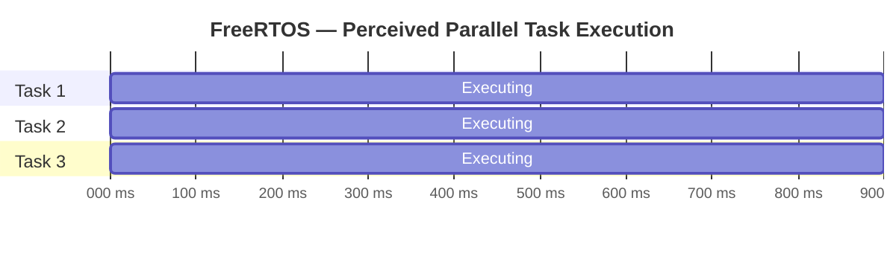
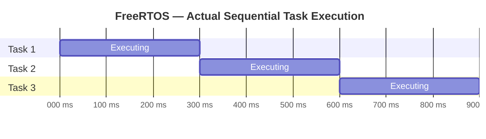

import { Picture } from 'astro:assets';
import { Aside } from '@astrojs/starlight/components';
import { Steps } from '@astrojs/starlight/components';
import { Icon } from '@astrojs/starlight/components';
import { Card, CardGrid, LinkCard } from '@astrojs/starlight/components';

## 1. What is an RTOS?
A **Real-Time Operating System (RTOS)** is a tiny operating system designed for microcontrollers.

In a normal `while(1)` firmware, *you* write the logic to decide what runs and when.
With an RTOS, the **kernel** decides which piece of code should run right now, based on priority and timing.

FreeRTOS is one specific RTOS. It gives you:
- Multitasking (multiple independent "things" running)
- Timing control (run every 10 ms, sleep for 200 ms, etc.)
- Safe communication between those things
- Deterministic behavior (you can predict timing)

<Aside>
Think of FreeRTOS as a traffic controller for your CPU.
</Aside>

### Looks Parallel, Runs Sequentially

Even though a **single-core microcontroller can only run one task at a time**, a real-time operating system like FreeRTOS switches between tasks so quickly that it feels like they’re all running simultaneously.

The figure below illustrates this idea with three tasks (red, blue, and green).
Time flows from left to right:

- In the top timeline, each task appears to be executing continuously — this is the illusion of **concurrency**.

- In the bottom timeline, you can see the real behavior — the CPU gives each task a small time slice before switching to the next one.

This rapid alternation is what makes multitasking systems look concurrent, even though only one task is truly running at any given instant.





---

## 2. Why do we need FreeRTOS?
Without FreeRTOS, code often becomes one giant loop full of `if(...)` and `delay()` calls:
```c
while (1) {
    readSensor();
    updateDisplay();
    logData();
    checkButtons();
    // ...and it keeps growing
}
```
Problems with that approach:
- One slow function delays everything else
- Hard to add new features without breaking timing
- Timing is imprecise (what is "every 10 ms" really doing?)
- No clean priority (what if checking a safety sensor is **more important** than updating the LCD?)

With FreeRTOS you split the firmware into **tasks**:
- `SensorTask`
- `DisplayTask`
- `LoggerTask`
- `ButtonTask`

Each task looks like its own mini-`while(1)` loop, and the RTOS decides which one runs and when.

---

## 3. Key Words You Must Know
These are terms we will use developing FreeRTOS applications:

### 3.1 Task
A task is like a lightweight thread. It's just a C function that never returns. Example idea:
- Task A reads a microphone
- Task B updates the LCD
- Task C talks over UART

Each task has:
- Its **own stack**
- A **priority** (importance level)
- A state (running, ready, blocked, suspended)

You create a task with `xTaskCreate()`.

---

### 3.2 Scheduler
The scheduler is the part of FreeRTOS that decides **which task runs right now**.
- Highest priority ready task runs first
- Lower priority tasks run only when higher ones are waiting/sleeping

When the scheduler starts, FreeRTOS takes control of the CPU timing. After that point, your `main()` never comes back.

---

### 3.3 Tick / System Tick
FreeRTOS keeps time using a periodic interrupt called the **tick interrupt**.
- Default tick rate is often 1000 Hz → 1 tick = 1 ms
- All delays (like `vTaskDelay()`) are based on ticks

If you call:
```c
vTaskDelay(pdMS_TO_TICKS(100));
```
that task is put to sleep for ~100 ms (100 ticks at 1 kHz).

While it's sleeping, other tasks can run.

---

### 3.4 Blocking / Delaying
When a task calls `vTaskDelay()`, it is **blocked** (paused). A blocked task uses **zero CPU**.
This is huge.

This means you should NOT write:
```c
for (volatile int i = 0; i < 999999; i++) { /* wait */ }
```
That wastes CPU.

Instead you should write:
```c
vTaskDelay(pdMS_TO_TICKS(10));
```
That politely tells the scheduler:
> "I'm good. Let someone else run for 10 ms."

---

## 4. What can FreeRTOS do for you?
Here are the main features that FreeRTOS provides:

### 4.1 Create and run concurrent tasks
You can run multiple loops "at the same time" without writing a crazy state machine.
- LED blink task
- Sensor sampling task
- UART print task
- Game logic task (Snake in Lab 3)

### 4.2 Precise timing and periodic work
You can run something every fixed time interval with clean, reliable timing:
- Sample audio every 2 ms
- Update a display at 30 FPS
- Log SD card data every 1 second

### 4.3 Communication between tasks
Tasks can safely send data to each other using:
- **Queues** (send a struct or a value)
- **Semaphores / Mutexes** ("let me use I2C now")
- **Event Groups** ("hey everyone, we got NEW_DATA and also WIFI_READY")
- **Task Notifications** (fast, lightweight pings)

FreeRTOS gives you thread-safe communication so you don't corrupt shared variables.

### 4.4 CPU usage control with priorities
Example: emergency stop button task gets higher priority than the OLED animation task.
- High priority → runs ASAP
- Low priority → runs when system is calm

You are in charge of these priorities.

### 4.5 Low power / Idle handling
When nothing needs to run, FreeRTOS can put the CPU in low power or idle mode. On battery systems this matters.

---

## 5. Life cycle of a typical FreeRTOS program
We'll draw the big picture:

1. **Hardware init** (clock, GPIO, UART, etc.)
2. **Create tasks** with `xTaskCreate()`
3. **Start the scheduler** with `vTaskStartScheduler()`
4. The RTOS takes over. From now on, tasks run forever.

After `vTaskStartScheduler()`, you normally never return to `main()`. The OS is officially in charge.

---

## 6. Additional Notes on Tasks and Stack Size

This lab uses FreeRTOS tasks extensively. The following notes clarify how to create tasks and choose an appropriate stack size.

### FreeRTOS API prefixes

FreeRTOS uses short, consistent prefixes that hint return types and intent. This helps you read signatures at a glance:

| Prefix | Meaning | Typical type/use | Examples |
| --- | --- | --- | --- |
| `v` | returns void | Procedures with side effects | `vTaskDelay`, `vTaskStartScheduler` |
| `x` | returns a value/status | Often `BaseType_t` (e.g., `pdPASS`/`pdFAIL`) or other value | `xTaskCreate`, `xQueueSend`, `xTaskGetTickCount` |
| `pv` | pointer to void | Generic pointer parameter or return | `pvParameters`, `pvPortMalloc` |
| `pc` | pointer to char | C string | `pcName`, `pcTaskGetName` |
| `px` | pointer to typed object/handle | Out-params or pointer variables | `pxCreatedTask`, `pxQueue` |
| `ux` | unsigned BaseType_t | Sizes, counts, priorities | `uxPriority`, `uxQueueMessagesWaiting` |
| `pd` | portable-defined macro/constant | Macros/constants from the portable layer | `pdTRUE`, `pdFALSE`, `pdMS_TO_TICKS` |

These conventions appear in function names and parameter/variable names throughout the API.

### `xTaskCreate` parameters

```c
BaseType_t xTaskCreate(
    TaskFunction_t pvTaskCode,       // Task entry: void (*)(void *)
    const char * const pcName,       // Debug/trace-friendly name
    configSTACK_DEPTH_TYPE usStackDepth, // Stack size (in words)
    void * const pvParameters,       // Argument passed to the task
    UBaseType_t uxPriority,          // Priority (relative to idle)
    TaskHandle_t * const pxCreatedTask // Optional handle out
);
```
Prototype (simplified for reference):

```c
BaseType_t xTaskCreate(
    TaskFunction_t pvTaskCode,       // Task entry: void (*)(void *)
    const char * const pcName,       // Debug/trace-friendly name
    configSTACK_DEPTH_TYPE usStackDepth, // Stack size (in words)
    void * const pvParameters,       // Argument passed to the task
    UBaseType_t uxPriority,          // Priority (relative to idle)
    TaskHandle_t * const pxCreatedTask // Optional handle out
);
```

Example:

```c
xTaskCreate(TimeTask, "Time", 512, NULL, tskIDLE_PRIORITY + 3, NULL);
```

<Aside type="tip" title="Stack units">
On ARM Cortex‑M ports, `usStackDepth` is specified in words (4 bytes), not bytes. For example, `512` equals 2048 bytes of stack.
</Aside>

### Choosing a stack size

- Start with 512 words (≈2 KB) for medium tasks like timekeeping and display.
- Lightweight tasks (e.g., button scanning) can often start at 256 words.
- Avoid large local arrays and recursion inside tasks; move buffers to static storage if needed.
- Measure and trim: call `uxTaskGetStackHighWaterMark(NULL)` in the task to log the minimum free stack observed, then reduce conservatively.
- Enable overflow checks: set `configCHECK_FOR_STACK_OVERFLOW` to `2` and implement `vApplicationStackOverflowHook()` for safety.
- Use `configMINIMAL_STACK_SIZE` as a baseline for very simple tasks; do not go below it.

<Aside type="note" title="Static allocation option">
If dynamic allocation is restricted, use `xTaskCreateStatic` with a user‑provided stack array and TCB:

```c
static StackType_t timeStack[512];
static StaticTask_t timeTCB;
(void)xTaskCreateStatic(TimeTask, "Time",
                        512, NULL, tskIDLE_PRIORITY + 3,
                        timeStack, &timeTCB);
```
</Aside>

---
## 7. Minimal Example (2 Tasks)
This example shows two tasks on a TM4C1294XL.
- Task 1: blink LED1 (PN0) every 2000 ms
- Task 2: blink LED2 (PN1) every 200 ms

```c

// FreeRTOS includes
#include "FreeRTOS.h"
#include "task.h"
// TivaWare / driverlib includes
//----------------------------------

// ---------- Task: Blink LED1 (slow) ----------
void LED1_Task(void *pvParameters) {
    (void)pvParameters; // unused
    while (1) {
        GPIOPinWrite(LED1_PORT, LED1_PIN, LED1_PIN);  // Turn ON
        vTaskDelay(pdMS_TO_TICKS(2000));              // Wait 2000 ms
        GPIOPinWrite(LED1_PORT, LED1_PIN, 0);         // Turn OFF
        vTaskDelay(pdMS_TO_TICKS(2000));              // Wait 2000 ms
    }
}

// ---------- Task: Blink LED2 (fast) ----------
void LED2_Task(void *pvParameters) {
    (void)pvParameters; // unused
    while (1) {
        GPIOPinWrite(LED2_PORT, LED2_PIN, LED2_PIN);  // Turn ON
        vTaskDelay(pdMS_TO_TICKS(200));               // Wait 200 ms
        GPIOPinWrite(LED2_PORT, LED2_PIN, 0);         // Turn OFF
        vTaskDelay(pdMS_TO_TICKS(200));               // Wait 200 ms
    }
}

int main(void) {
    // Hardware initialization here (clocks, GPIOs, etc.)

    // Create tasks
    xTaskCreate(LED1_Task, "LED1", 128, NULL, 1, NULL);
    xTaskCreate(LED2_Task, "LED2", 128, NULL, 1, NULL);

    // Start the scheduler (does not return on success)
    vTaskStartScheduler();

    // Should never get here (e.g., not enough heap to start idle task)
    while (1) {}
}

```

### Key takeaways from the example
- Each `while(1)` loop became its own task function.
- We NEVER call `delay()` or spin-wait. We use `vTaskDelay()`.
- After `vTaskStartScheduler()`, **the RTOS is in control**.

---

## 8. Task States (important for debugging)
A task in FreeRTOS can be:
- **Running** – it's currently using the CPU.
- **Ready** – it could run, but something else with higher or equal priority is running.
- **Blocked** – it's waiting (for time to pass, for data in a queue, for a semaphore, etc.).
- **Suspended** – it's paused manually.

Why you care: if a task is *Blocked* most of the time, that's actually good. It means it's not wasting CPU.

---

## 9. Golden Rules for Writing Good FreeRTOS Tasks
1. **Do not busy-wait**. Use `vTaskDelay()` instead of `for(;;){}` loops that burn cycles.
2. **Keep tasks focused.** One task = one job.
3. **Give critical tasks higher priority.** Example: safety shutdown logic.
4. **Use queues instead of global variables** when passing data between tasks.
5. **Watch your stack usage.** Each task gets its own stack. Too small = crash. Too big = you run out of RAM.
6. **NEVER call FreeRTOS API from an interrupt unless the function name ends with `FromISR`.**
   - `xQueueSendFromISR(...)` ✅
   - `xQueueSend(...)` ❌ inside an ISR

---

## 10. Where we're going next in lab
After you understand tasks and `vTaskDelay()`, the next steps are:
1. **Queues** – pass sensor data from an ISR / producer task to a consumer task.
2. **Semaphores / Mutexes** – protect shared peripherals like I2C or SPI.
3. **Software timers** – run code periodically *without* creating a dedicated task.
4. **CPU usage / debugging** – see which task is starving others.

That is basically 80% of practical FreeRTOS in real embedded products.

---

## 11. Vocabulary Recap
- What is a task?
- What does the scheduler do?
- What is the tick rate?
- What does `vTaskDelay()` do?
- What is task priority?
- What are the 4 task states?

If you can explain those, you’re ready to start coding with FreeRTOS!

---

<Aside type="tip">
FreeRTOS lets you structure firmware as multiple small loops (tasks) that run under a scheduler with priorities and clean timing. You stop thinking "what runs next" and start thinking "what does this task do".
</Aside>

