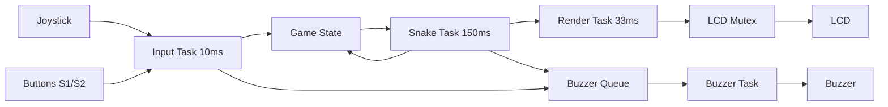

import { Aside } from '@astrojs/starlight/components';
import { Card, CardGrid, LinkCard } from '@astrojs/starlight/components';

## Prerequisites

<CardGrid>
   <LinkCard
      title="Complete Lab 2"
      description="Make sure you finished Lab 2 before starting."
      href="/labs/lab2/"
      icon="setting"
   />
   <LinkCard
       title="Download Lab 3 Starter Code"
       description="Download the base Snake game implementation."
       href="/assets/lab_files/snake_base_lab3.zip"
       icon="right-arrow"
    />
   <LinkCard
      title="Back to Lab Summary"
      description="Return to the list of all labs."
      href="/guides/labtimeline/"
      icon="right-arrow"
   /> 
</CardGrid>

---

## Objective

In this lab, you will build a complete **Snake game** on the TM4C1294XL LaunchPad using FreeRTOS. Starting from a basic working snake implementation, you'll add game features like fruit collection, scoring, collision detection, and audio feedback. The focus is on **modular task design**, **mutex synchronization**, and **queue-based communication**.

---

## Learning Goals

- Organize a real-time application into modular, concurrent tasks
- Use a **mutex** to protect shared resources (LCD display and game state)
- Implement **queue-based communication** between tasks (for audio events)
- Understand task synchronization and timing in FreeRTOS
- **Design and implement game logic** by thinking through requirements
- Build a complete game incrementally following best practices

---

## Grading Rubric

| Step | Task | Description | Points |
| :--- | :--- | :----------- | :----: |
| 1 | Run Snake Base | Build and run the provided Snake starter; verify snake moves with joystick | 8 |
| 2 | LCD Mutex Protection | Guard all LCD drawing with a mutex; avoid blocking while mutex is held | 12 |
| 3 | Buzzer via Queue + Buttons | Implement buzzer task with queue; button events trigger tones | 12 |
| 4 | Random Fruit Spawn | Place fruit at random grid locations; avoid spawning on snake body | 5 |
| 5 | **Design Score System** | **Think through and implement** score increment and fruit lifecycle | 14 |
| 6 | **Design Audio Feedback** | **Analyze requirements and implement** eating sound logic | 9 |
| 7 | **Design Game Rules** | **Reason about and implement** movement constraints and collision detection | 15 |
|   | Lab report | Written lab report with design decisions and reflection | 25 |
|   | **Total** |  | **100 points** |

---

## Expected Results

By the end of this lab:

- Snake moves smoothly with joystick control
- All LCD operations are mutex-protected (no visual corruption)
- Button presses trigger audible buzzer feedback
- Fruit spawns randomly and never on the snake body
- Score increases when eating fruit; new fruit appears
- Eating fruit plays a distinct sound
- Cannot reverse direction instantly; self-collision ends game
- Code is modular with separate files for each subsystem

---

## Getting Started

### Step 1: Create a new CCS project

Create a new CCS project with FreeRTOS support, similar to Lab 2.

<LinkCard
    title="FreeRTOS Project Setup"
    description="Checklist to add FreeRTOS to your CCS project."
    href="/guides/freertos/freertosproyects/"
    icon="right-arrow"
    target="_blank"
    rel="noopener noreferrer"
/>

### Step 2: Add required libraries

Add the LCD driver, graphics library, and FreeRTOS libraries to your project.

<LinkCard
     title="Download Libraries"
     description="Download libraries needed for the lab."
     href="/assets/libraries/libraries.zip"
     icon="right-arrow"
/>

<LinkCard
     title="Importing External Libraries"
     description="Instructions for importing external libraries into CCS."
     href="/guides/ccs/external_libraries/"
     icon="right-arrow"
/>

### Step 3: Import starter code

Download and extract the starter code, then drag and drop all files into your CCS project.

Starter files structure:

```
snake_base_lab3/
├─ app_objects.h    # Shared objects (mutex, graphics context)
├─ display.cpp      # LCD initialization and drawing functions
├─ display.h        # Display API declarations
├─ game.cpp         # Snake movement logic and game state
├─ game.h           # Game data structures and API
└─ main.cpp         # System setup and FreeRTOS tasks
```

### Step 4: Build and verify

Build and run the project. You should see:

- Green snake head with yellow body segments
- Snake moves with joystick (8-directional control)
- S1 button pauses/resumes the game
- S2 button resets the game
- Snake wraps around screen edges

<Aside type="tip">
The starter code provides a fully functional snake with basic movement. Your job is to add game mechanics (fruit, scoring, collision) and proper synchronization!
</Aside>

---

## Understanding the Starter Code

Before adding features, let's understand what's already implemented:

### Game Architecture

The project uses three FreeRTOS tasks that run concurrently:



### File Structure Overview

**app_objects.h** - Declares shared global objects:
- `gContext` - Graphics library context for LCD
- `gSysClk` - System clock frequency
- `xMutexLCD` - Mutex for LCD access (declared but not yet created!)

**game.h / game.cpp** - Contains game state and logic:
- `SnakeGameState` - Current direction, running status, reset flag
- `Position` array for snake segments
- `moveSnake()` - Updates snake position each game tick
- `ResetGame()` - Initializes snake to starting position

**display.h / display.cpp** - Handles LCD operations:
- `LCD_Init()` - Configures LCD hardware
- `DrawGame()` - Renders snake on black background
- `drawCell()` - Helper to draw single grid cell

**main.cpp** - System initialization and tasks:
- Clock configuration
- Button and joystick setup
- Three FreeRTOS tasks (Input, Snake, Render)

### How the Game Currently Works

**Grid System:**
- Display is 128×128 pixels
- Each cell is 8×8 pixels
- Results in 16×16 grid (256 possible positions)

<p align="center">
  
    <br />
  <sub><span> Snake Grid Representation</span></sub>
</p>

**Snake Representation:**

```c
Position snake[MAX_LEN];  // Array of {x, y} coordinates
uint8_t snakeLength = 4;  // Current snake length
```

- `snake[0]` is the head (drawn in green)
- `snake[1]` to `snake[snakeLength-1]` is the body (drawn in yellow)

**Movement Logic:**

1. Shift all body segments: each segment moves to the position of the one ahead
2. Update head position based on current direction
3. Wrap around screen edges (no wall collisions yet)

**Current Limitations:**

- No fruit or scoring system
- No collision detection
- No mutex protection (potential for display corruption)
- Can reverse direction instantly (unrealistic)
- No audio feedback

---

## Core Concepts

### What is a Mutex?

A **mutex (mutual exclusion)** prevents multiple tasks from accessing a shared resource simultaneously. Think of it as a lock that only one task can hold at a time.

**Why do we need it?**

The LCD display is a shared resource. If two tasks try to draw at the same time, the display will show corrupted graphics or SPI communication will fail.

**Without mutex (WRONG - can cause corruption):**

```c
void TaskA() {
    DrawSnake();  // Task A drawing...
}

void TaskB() {
    DrawScore();  // Task B drawing at SAME TIME!
}
```

**With mutex (CORRECT):**

```c
void TaskA() {
    xSemaphoreTake(xMutexLCD, portMAX_DELAY);
    DrawSnake();  // Only Task A can draw now
    xSemaphoreGive(xMutexLCD);
}

void TaskB() {
    xSemaphoreTake(xMutexLCD, portMAX_DELAY);  // Waits for Task A to finish
    DrawScore();  // Now Task B can safely draw
    xSemaphoreGive(xMutexLCD);
}
```
For more details, see:
<LinkCard
     title="FreeRTOS Mutex Guide"
     description="Learn how to use mutexes in FreeRTOS."
     href="/guides/freertos/semaphores-mutexes/"
     icon="right-arrow">
</LinkCard>

### What is a Queue?

A **queue** is a FreeRTOS mechanism for sending data between tasks. It's **thread-safe** and allows tasks to communicate without directly accessing shared variables.

**Example: Audio Events**

Instead of playing sounds directly (which would block), we send "sound requests" to a dedicated buzzer task:

```c
// From any task - non-blocking
BuzzerEvent event = {1000, 100};  // 1000Hz for 100ms
xQueueSend(xBuzzerQueue, &event, 0);

// Buzzer task receives and plays
BuzzerEvent receivedEvent;
xQueueReceive(xBuzzerQueue, &receivedEvent, portMAX_DELAY);
PlayTone(receivedEvent.frequency, receivedEvent.duration);
```
For more details, see:
<LinkCard
     title="FreeRTOS Queue Guide"
     description="Learn how to use queues in FreeRTOS."
     href="/guides/freertos/queues/"
     icon="right-arrow">
</LinkCard>
---

## Implementation Steps

### Step 1: Run Snake Base (8 points)

**Goal:** Verify that the basic snake game works without modifications.

Build and run the starter code. Test:

- Snake moves smoothly with joystick
- Pause/resume with S1 button
- Reset game with S2 button
- Snake wraps around screen edges

<Aside type="caution">
If you see display corruption or random crashes, it means multiple tasks are accessing the LCD simultaneously. This will be fixed in Step 2!
</Aside>

---

### Step 2: LCD Mutex Protection (12 points)

**Goal:** Prevent multiple tasks from drawing to LCD simultaneously using a mutex.

#### Understanding the Problem

Right now, the Render task calls `DrawGame()` every 33ms, but other tasks might also want to draw (like showing text). Without protection, this causes display corruption.

#### Implementation

**Create the mutex in main():**

```c
int main(void)
{
    // ... existing initialization ...
    
    // Create mutex for LCD protection
    xMutexLCD = xSemaphoreCreateMutex();
    if (xMutexLCD == NULL) {
        // Mutex creation failed - handle error
        while(1);  // Halt system
    }
    
    // ... create tasks ...
}
```

**Protect LCD access in vRenderTask():**

```c
static void vRenderTask(void *pvParameters)
{
    (void)pvParameters;
    LCD_Init();
    TickType_t last = xTaskGetTickCount();
    for(;;)
    {
        // Acquire mutex before drawing
        xSemaphoreTake(xMutexLCD, portMAX_DELAY);
        DrawGame(&gameState);
        xSemaphoreGive(xMutexLCD);  // Release immediately after
        
        vTaskDelayUntil(&last, pdMS_TO_TICKS(33));
    }
}
```

**Testing:**
- No visual corruption or crashes
- Smooth graphics rendering

<Aside type="tip">
Always pair `xSemaphoreTake()` with `xSemaphoreGive()`! Think of it as opening and closing a door - you must close it when you're done.
</Aside>

---

### Step 3: Buzzer via Queue + Buttons (12 points)

**Goal:** Design and implement a buzzer subsystem that plays sounds based on queue events.

#### 🔊 Design Questions

Before implementing, consider these architectural questions:

1. **Why would blocking for sound be bad?**
   - What happens if Input task waits 100ms for a beep to finish?
   - How does this affect joystick responsiveness?

2. **What data needs to be passed between tasks?**
   - What information defines a "sound event"?
   - How many different sounds might be queued up?

3. **Task responsibilities:**
   - Which task should **produce** sound events?
   - Which task should **consume/play** sound events?
   - How should they communicate without shared variables?

4. **Integration with existing architecture:**
   - Where does buzzer initialization belong?
   - Which task priority should the buzzer task have? Why?

<Aside type="tip">
You've used the buzzer in previous labs!
</Aside>

#### Provided Files

**buzzer.h (Complete header - use as-is):**

```c
#pragma once
#include <stdint.h>

// Hardware mapping for the buzzer (PF1 -> M0PWM1 / Generator 0)
#define BUZZER_PWM_BASE    PWM0_BASE
#define BUZZER_GEN         PWM_GEN_0
#define BUZZER_OUTNUM      PWM_OUT_1
#define BUZZER_OUTBIT      PWM_OUT_1_BIT
#define BUZZER_GPIO_BASE   GPIO_PORTF_BASE
#define BUZZER_GPIO_PIN    GPIO_PIN_1

// Buzzer event structure sent via queue
typedef struct {
    uint32_t frequency;  // Hz
    uint32_t duration;   // milliseconds
} BuzzerEvent;

// Public API functions
void Buzzer_Init(void);
void Buzzer_Post(uint32_t freq, uint32_t durationMs);

// Internal functions (implement these)
static void vBuzzerTask(void* pvParameters);
static void Buzzer_HWInit(void);
static void Buzzer_Start(uint32_t freq_hz);
static void Buzzer_Stop(void);
```

**buzzer.cpp (Function skeletons - implement the logic!):**

```c
#include "buzzer.h"
#include "app_objects.h"

extern "C" {
#include "driverlib/pwm.h"
#include "driverlib/sysctl.h"
#include "driverlib/pin_map.h"
#include "driverlib/gpio.h"
#include "inc/hw_memmap.h"
#include "FreeRTOS.h"
#include "task.h"
#include "queue.h"
}

// TODO: Declare queue handle for buzzer events

// TODO: Implement the buzzer task
// This task should:
// 1. Wait for events from the queue
// 2. Start PWM with correct frequency  
// 3. Wait for specified duration
// 4. Stop PWM
static void vBuzzerTask(void* pvParameters)
{
    // Your implementation here
}

// TODO: Implement hardware initialization
// You've done this before! Set up GPIO pin and PWM peripheral
static void Buzzer_HWInit(void)
{
    // Your implementation here
}

// TODO: Configure PWM to generate specific frequency
// Calculate period from frequency and system clock
static void Buzzer_Start(uint32_t freq_hz)
{
    // Your implementation here
}

// TODO: Disable PWM output
static void Buzzer_Stop(void)
{
    // Your implementation here
}

// TODO: Initialize complete buzzer subsystem
// 1. Initialize hardware (GPIO + PWM)
// 2. Create queue for events
// 3. Create and start buzzer task
void Buzzer_Init(void)
{
    // Your implementation here
}

// TODO: Post sound event to queue (non-blocking)
// Create event struct and send to queue
void Buzzer_Post(uint32_t freq, uint32_t durationMs)
{
    // Your implementation here
}
```

#### Your Implementation Tasks

**Task 3A: Queue Communication Design**
- What size should your queue be? (Consider: burst button presses)
- Should `Buzzer_Post()` block if queue is full? Why/why not?
- What data structure represents a sound event?

**Task 3B: Hardware Integration**  
- Where should `Buzzer_Init()` be called in main()?
- What PWM clock divider works well for audio frequencies?
- How do you calculate PWM period from desired frequency?

**Task 3C: Task Priority and Timing**
- What priority should buzzer task have relative to Input/Snake/Render?
- Should buzzer task have higher or lower priority than game logic? Why?

**Task 3D: Button Feedback Integration**
- Add `Buzzer_Post()` calls to button press handlers
- Choose different frequencies for S1 vs S2 (make them distinguishable)
- Test that sounds don't interfere with game responsiveness

#### Implementation Strategy

1. **Start with hardware functions** (you've done this before!)
   - `Buzzer_HWInit()` - GPIO + PWM setup
   - `Buzzer_Start()` - Configure PWM for frequency
   - `Buzzer_Stop()` - Disable PWM output

2. **Add FreeRTOS integration**
   - Create queue in `Buzzer_Init()`
   - Implement `vBuzzerTask()` with queue receive loop
   - Connect `Buzzer_Post()` to queue send

3. **Test incrementally**
   - Test hardware functions first (direct PWM calls)
   - Test queue communication (send/receive events)
   - Test full integration (button press → queue → sound)

#### Testing Checklist

- ✅ S1 button produces distinct beep sound
- ✅ S2 button produces different beep sound  
- ✅ Sounds don't block input processing
- ✅ Multiple rapid button presses queue properly
- ✅ Game remains responsive during sound playback
- ✅ No crashes or system hangs

#### Debug Tips

**No sound at all:**
- Check GPIO pin configuration
- Verify PWM peripheral is enabled and ready
- Test with simple PWM first (before queue)

**Sounds play but input is sluggish:**
- Check task priorities
- Ensure `Buzzer_Post()` is non-blocking
- Verify Input task isn't waiting for buzzer
---

### Step 4: Random Fruit Spawn (5 points)

**Goal:** Add a fruit that appears at random empty positions on the grid.

#### Understanding the Context

A Snake game without fruit is just a moving line! The fruit serves several purposes:
- **Primary objective** for the player
- **Growth trigger** for the snake
- **Score mechanism** basis 
- **Visual interest** on an otherwise empty grid

But random placement has a critical constraint: **never spawn on the snake body** (that would be unfair to the player!).

#### The Spawning Challenge

**The Problem:**
On a 16×16 grid (256 total positions), how do you find a random empty cell when the snake occupies some positions?

**Naive Approach (DON'T DO):**
```c
// This could loop forever if snake fills most of the grid!
do {
    x = rand() % GRID_SIZE;
    y = rand() % GRID_SIZE;
} while (position_occupied);
```

**Better Approach:**
The algorithm we'll implement is simple and works well for small-to-medium snake lengths:
1. Generate random position
2. Check if position is occupied by any snake segment  
3. If occupied, try again
4. If empty, place fruit there

This works because early in the game, the snake is small and most positions are free. Later in the game (when snake is large), finding empty spots takes a few more attempts but still completes quickly.

#### Understanding the Requirements

The fruit should:
- **Appear as a red cell** on the grid (visually distinct from green/yellow snake)
- **Spawn at random positions** (not predictable patterns)
- **Never spawn on snake body** (any of the snake segments)
- **Only one fruit at a time** (not multiple fruits simultaneously)
- **Persist until eaten** (doesn't disappear on its own)

#### Implementation

**Add fruit state variables to game.h:**

```c
// Add after snake declarations
extern Position fruit;
extern bool hasFruit;  // Track if fruit is currently placed
```

**Add necessary function declarations to game.h:**

```c
void SpawnFruit(void);
```

**Implement the collision detection helper in game.cpp:**

This function checks if a given position (x,y) is occupied by any part of the snake:

```c
// Check if position collides with snake
static bool IsPositionOnSnake(uint8_t x, uint8_t y)
{
    for (uint8_t i = 0; i < snakeLength; ++i) {
        if (snake[i].x == x && snake[i].y == y) {
            return true;
        }
    }
    return false;
}
```

**Implement the fruit spawning algorithm in game.cpp:**

```c
// Global fruit state (add near top of file with other globals)
Position fruit;
bool hasFruit = false;

// Place fruit at random empty position
void SpawnFruit(void)
{
    uint8_t x, y;
    
    // Keep trying random positions until we find an empty cell
    do {
        x = rand() % GRID_SIZE;
        y = rand() % GRID_SIZE;
    } while (IsPositionOnSnake(x, y));
    
    fruit.x = x;
    fruit.y = y;
    hasFruit = true;
}
```

**Update ResetGame() to spawn initial fruit:**

```c
void ResetGame(void)
{
    // ... existing snake initialization ...
    
    // Reset score and spawn first fruit
    score = 0;  // Note: you'll add this variable in Step 5
    SpawnFruit();
}
```

**Update DrawGame() to render fruit in display.cpp:**

Add this code after drawing the snake but before the final GrFlush:

```c
void DrawGame(const SnakeGameState* state)
{
    // ... existing background and snake drawing ...
    
    // Draw fruit (if exists)
    if (hasFruit) {
        drawCell(fruit.x, fruit.y, ClrRed);
    }
    
    // ... rest of function (score, game over text, etc.) ...
}
```

#### Algorithm Analysis

**Why this approach works:**
- **Simple to understand** and implement
- **Guaranteed to terminate** (there's always at least one empty cell early in game)
- **Uniform distribution** across all empty cells
- **Performance**: Average attempts = total_cells / empty_cells

**Performance examples:**
- Snake length 4 on 16×16 grid: ~1.02 attempts average
- Snake length 50 on 16×16 grid: ~1.24 attempts average  
- Snake length 200 on 16×16 grid: ~4.5 attempts average

The algorithm only becomes slow when the snake fills most of the grid, but at that point the player has nearly won!

#### Testing Checklist

- ✅ Red fruit appears on grid at startup
- ✅ Fruit never spawns on snake head or body segments
- ✅ Each game reset creates fruit at different location
- ✅ Fruit position is visually distinct (red vs green/yellow snake)
- ✅ Only one fruit visible at any time

#### Common Implementation Issues

**Fruit spawns on snake body:**
- Check that `IsPositionOnSnake()` loops through ALL snake segments (0 to snakeLength-1)
- Verify snake position updates happen before fruit spawning

**No fruit appears:**
- Ensure `hasFruit` is set to true in `SpawnFruit()`
- Check that `DrawGame()` includes fruit drawing logic
- Verify fruit drawing happens after background clear but before GrFlush

**Fruit appears at same location repeatedly:**
- Make sure `rand()` is properly seeded (should be done in system initialization)
- Check that modulo operation uses `GRID_SIZE` not hard-coded values

<Aside type="tip">
This step builds the foundation for the scoring system. Once fruit spawning works reliably, detecting when the snake "eats" it becomes straightforward position comparison!
</Aside>

---

### Step 5: Design Score System (12 points) 

**Goal:** Think through and implement the scoring mechanics when snake eats fruit.

#### 🤔 Design Questions

Before implementing, consider these questions:

1. **When should the score increase?**
   - Every game tick? When snake moves? When fruit is eaten?
   
2. **What needs to happen when fruit is eaten?**
   - Just increment score? Remove fruit? Spawn new fruit? Change snake?
   
3. **How do we detect that fruit was eaten?**
   - What condition indicates the snake head touched the fruit?
   
4. **What's the lifecycle of a fruit?**
   - Spawn → Exist → Get Eaten → ??? → Spawn New

5. **Where should this logic live?**
   - Input task? Snake task? Render task? Why?

<Aside type="tip">
Spend 5-10 minutes thinking about these questions and discussing with teammates before writing any code. The goal is to understand the problem before jumping to solutions!
</Aside>

#### Implementation Requirements

Based on your design thinking, implement the following:

**Add necessary variables to game.h:**
- A score variable to track current points
- Any other state you identified in your design

**Create game functions you identified:**
- A function to check if fruit was eaten
- A function to handle what happens when fruit is eaten
- A function to increase snake size (since snake grows when eating)

**Pseudocode for eating logic:**
```
IF snake head position == fruit position AND fruit exists:
    increase score by 1
    mark fruit as eaten/removed
    make snake grow by 1 segment
    spawn new fruit at different location
```

**Where to place the logic:**
- Consider: Which task is responsible for moving the snake and checking game state?
- Place your eating detection in the appropriate task's main loop

**Testing checklist:**
- Score starts at 0 and increments when eating fruit
- Old fruit disappears when eaten
- New fruit spawns immediately at different location
- Snake grows by one segment each time
- Score displays correctly on screen

#### Hints (Only Read if Stuck!)

<details>
<summary>Click here for implementation hints</summary>

- You'll need to add `extern uint16_t score;` to game.h
- The eating check belongs in vSnakeTask (it's checking game state after movement)
- You need functions like: `bool HasEatenFruit()` and `void GrowSnake()`
- Growing the snake means increasing `snakeLength` and extending the body array
- Don't forget to update the score display in DrawGame()

</details>

---

### Step 6: Design Audio Feedback (8 points)

**Goal:** Analyze requirements and implement satisfying audio feedback when eating fruit.

#### 🎵 Design Questions 

1. **What kind of sound should play when eating fruit?**
   - High pitched? Low pitched? Long? Short? Why?
   - How should it differ from button press sounds?

2. **When exactly should the sound play?**
   - Before eating? During eating? After eating?
   - What if multiple fruits are eaten quickly?

3. **What frequency range feels "good" for eating?**
   - Reward sounds are typically higher frequency (1200-2000 Hz)
   - Duration should be noticeable but not annoying (50-150ms)

4. **How does this integrate with existing buzzer system?**
   - Can you reuse `Buzzer_Post()`? 
   - Where should you call it from?

#### Implementation Challenge

Using your existing buzzer system, add audio feedback for fruit eating:

1. **Choose your sound parameters:**
   - Frequency: ___ Hz (experiment to find what sounds good!)
   - Duration: ___ ms

2. **Integrate with eating logic:**
   - Add the buzzer call to your fruit eating detection
   - Make sure it only plays once per fruit

3. **Test different sounds:**
   - Try 3-4 different frequency/duration combinations
   - Pick the one that feels most satisfying

**Testing:**
- Pleasant tone plays every time you eat fruit
- Different from button press sounds
- No repeated sounds for same fruit

<Aside type="tip">
Experiment with different frequencies (800-2000 Hz) to find a satisfying "eat" sound! Sound design is part of game feel.
</Aside>

---

### Step 7: Design Game Rules (15 points)

**Goal:** Reason about and implement realistic movement constraints and game over conditions.

#### 🧠 Problem Analysis

Real Snake games have these rules:
1. **Cannot reverse direction instantly** (moving RIGHT then immediately LEFT is impossible)
2. **Game ends when snake hits itself** (head touches any body segment)
3. **Game over state needs to be handled** (stop game, show message, allow restart)

Let's think through each problem:

#### Part A: Movement Constraint Analysis

**The Problem:**
Currently, if snake is moving RIGHT and player presses LEFT, the snake reverses instantly and "eats itself" in one frame.

**Questions to consider:**
1. What directions should be forbidden based on current direction?
2. When should direction changes be ignored vs. accepted?
3. How can you determine if a direction is "opposite" to current direction?

**Your Task:**
- Design a function to determine opposite directions
- Modify input handling to reject opposite direction changes
- Think: Should diagonal inputs (NE, SW, etc.) be handled differently?

#### Part B: Collision Detection Design  

**The Problem:**
How do you detect when the snake head has collided with its own body?

**Analysis Questions:**
1. What data do you have available? (snake array, positions, length)
2. Which part of snake can collide with which other parts?
3. When should collision be checked? (before move? after move?)
4. What makes a collision vs. valid position?

**Your Design Challenge:**
- Write pseudocode for collision detection BEFORE coding
- Consider edge cases: Can head collide with position [0]? Why not?
- Think about performance: Do you need to check all segments?

#### Part C: Game Over State Management

**The Problem:**
When collision is detected, what should happen to game state?

**System Design Questions:**
1. Which task should detect collision?
2. How should game state change when collision occurs?
3. What feedback should player get? (visual, audio, both?)
4. How does player restart after game over?

**Integration Questions:**
1. How does this work with existing pause/resume system?
2. Should snake keep moving during game over? 
3. What prevents multiple collision detections?

#### Implementation Challenges

Now implement your designs:

**Challenge 1: Anti-Reverse Function**
```c
// Design and implement this function
Direction GetOppositeDirection(Direction dir);

// Use it in input handling to reject bad moves
// Pseudocode:
// newDirection = getDirectionFromJoystick();
// IF newDirection != opposite(currentDirection):
//     accept the direction change
```

**Challenge 2: Collision Detection**
```c
// Design and implement collision detection
bool HasSelfCollision(void);

// Think about:
// - Which array indices to check?
// - When to call this function?  
// - What constitutes a collision?
```

**Challenge 3: Game Over Integration**
- Modify your snake task to handle collision detection
- Add appropriate state changes when collision occurs
- Add audio/visual feedback for game over
- Ensure restart mechanism works properly

#### Testing Scenarios

Test each rule thoroughly:

**Movement Rules:**
- Moving RIGHT then pressing LEFT immediately → should do nothing
- Moving UP then pressing DOWN immediately → should do nothing  
- Moving RIGHT then pressing UP → should turn up normally
- All 8 joystick directions work as expected

**Collision Detection:**
- Snake with length 4: head at (5,5), body at (4,5),(3,5),(2,5) 
- Move LEFT → head goes to (4,5) → collision detected ✓
- Move UP → head goes to (5,4) → no collision ✓

**Game Over Flow:**
- Collision detected → game stops moving
- Audio feedback plays once  
- Game over message appears
- S2 button restarts game properly
- Score resets correctly

#### Advanced Thinking (Optional)

If you finish early, consider:
- Should there be a short delay before allowing restart?
- Could you add a "high score" that persists across games?
- How would you make the game progressively faster as score increases?

---

## Final Testing Checklist

Before submitting, verify all features work:

- ✅ Step 1: Base game runs, snake controlled by joystick
- ✅ Step 2: No visual glitches (mutex protecting display)  
- ✅ Step 3: Buttons produce different beep sounds
- ✅ Step 4: Red fruit appears at random positions
- ✅ Step 5: Eating fruit increases score, snake grows, new fruit spawns
- ✅ Step 6: Pleasant sound plays when eating fruit
- ✅ Step 7: Cannot reverse instantly; self-collision stops game

---

## Reflection Questions (For Lab Report)

After completing the lab, reflect on these questions:

### Design Process
1. Which step required the most thinking before coding? Why?
2. How did breaking down problems into smaller questions help?
3. What alternative designs did you consider for collision detection?

### FreeRTOS Concepts
1. Why is the mutex necessary for LCD protection? What would happen without it?
2. How does the buzzer queue improve system responsiveness compared to blocking delays?
3. Which task priorities did you choose and why?

### Game Design
1. What makes the eating sound feel rewarding vs. annoying?
2. How do movement constraints affect gameplay feel?
3. What other game rules could you add using similar patterns?

### Code Quality
1. How did modular file organization help during development?
2. What makes code "easy to change" vs. "hard to change"?
3. How would you add new features (power-ups, obstacles, multiplayer)?

---

## Code Quality Tips

### File Organization

Keep your code modular:
- **buzzer.h/cpp** - Only buzzer/audio logic
- **display.h/cpp** - Only LCD/drawing functions  
- **game.h/cpp** - Only game rules and state
- **main.cpp** - Only system setup and task coordination
---

## Additional Resources

<CardGrid>
<LinkCard
    title="FreeRTOS Mutex API"
    description="Official documentation for semaphores and mutexes"
    href="https://www.freertos.org/a00113.html"
    icon="external"
/>

<LinkCard
    title="FreeRTOS Queue API"  
    description="Learn about queue operations and best practices"
    href="https://www.freertos.org/a00018.html"
    icon="external"
/>

<LinkCard
    title="Lab 2 Reference"
    description="Review button handling and task creation"
    href="/labs/lab2/"
    icon="document"
/>
</CardGrid>

---

Good luck building your Snake game! 🐍